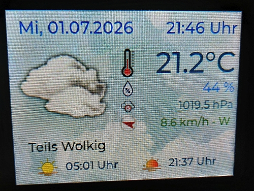
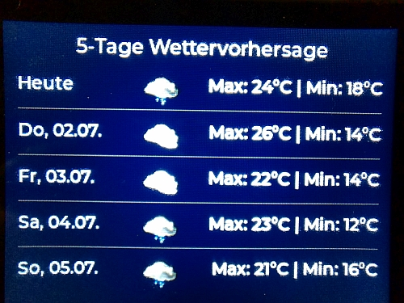
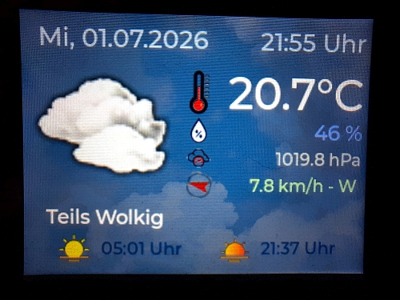

# ES3C28P

ESP32-S3 ES3C28P MODUL

\# Wetterstation

Bitte in der *.ino WLAN- Daten eintragen und die Koordinaten Latitude/ Longtitude und ggf. Zeitzone

Achtung ! Dieses Modul erfordet LVGL 8.2.0

Hier Fotos von meinem fertigen Projekt:

\## Features \& Funktionen

\* \*\* Wetterdaten aus der Open Meteo App per Latitude/ Longtitude

\* \*\* Datum, Uhrzeit

\* \*\* Temperatur, Luftfeuchte, Luftdruck

\* \*\* Windrichtung (Pfeil zeigt automatisch Richtung an) und Windgeschwindigkeit

\* \*\* Sonnenauf-und untergang

\* \*\* wechselt automatisch in den Nachtmodus

\* \*\* wechselt per Touch in die 5-Tage Vorschau und zurueck

\## Steuerung (Touch)

\* Wettervorschau

\---

\*Created by Onkel Kaktus\* 🌵

